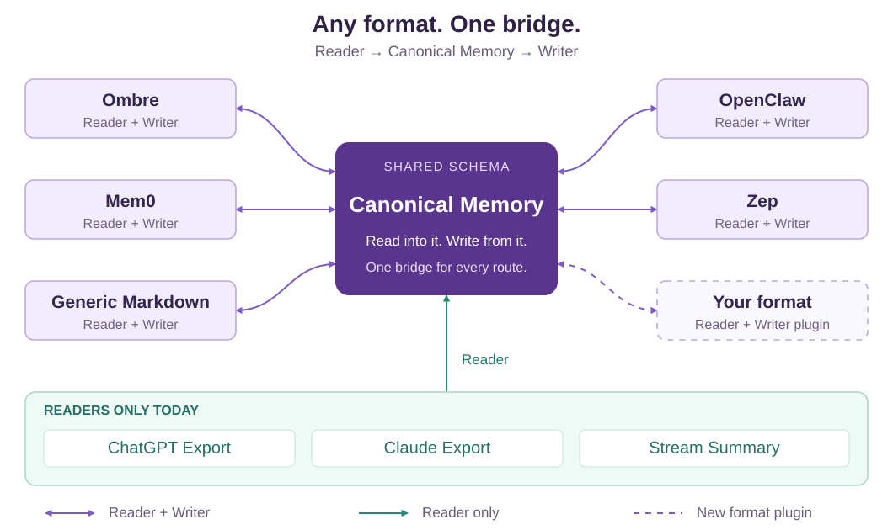

# memlink

**Pandoc for AI memories.**

Offline migration and context handoff between AI memory file formats.

[](https://github.com/velnori/memlink/actions/workflows/test.yml?query=branch%3Amain)
[](https://www.python.org/)
[](https://pypi.org/project/memlink-bridge/)
[](LICENSE)
[](https://github.com/astral-sh/ruff)

Each format uses `Reader → Canonical Memory → Writer`. Canonical-v1 remains frozen. This checkout is the local **2.0.0** implementation; it has not been published.

MemLink converts all records inside a supplied source root automatically. It requires no AI service, API key, per-record review, or manual classification. `--all` includes archived records inside that approved scope. Readers report invalid and unsupported inputs instead of silently counting them as successful conversions.

## Why MemLink? n² → 2n

Different tools store memories in different formats. Connecting every format directly to every other format creates a growing web of converters.

For **n formats with both reading and writing support**, separate one-way converters need **n(n − 1)** routes: **O(n²)**. A shared canonical model needs **n Readers + n Writers = 2n adapters**: **O(n)**. With 10 such formats, that is 90 one-way converters versus 20 adapters.

MemLink's goal is **any memory format ↔ any memory format**, through one shared model. Each format contributes its own Reader and Writer. When both formats have these adapters, either can be the source or the destination:



Two-headed arrows show existing Reader + Writer pairs. One-way arrows show current Readers only. The dashed route is the extension point for [your own format](docs/api/plugin.md). Adding a format means contributing its adapters to this bridge, rather than implementing every pairwise converter. The supported variants below show the actual available roles.

The bridge handles conversion routes. Field differences are measured and reported in receipts, with recoverable canonical values kept in the archive; a shared schema does not make every field a native feature of every destination.

## Run this checkout

Python 3.10–3.12 and PyYAML ≥6.0.3 are the declared environment. Install this checkout with `python -m pip install .`, or use the source package with the declared dependency installed.

From the repository root in PowerShell, expose the source package for these reproducible examples:

```powershell
$env:PYTHONPATH = (Resolve-Path python).Path
python -m memlink.cli --version
python -m memlink.cli formats
```

After installing the local wheel, `memlink` is the equivalent command. Use a new/empty destination for `convert`.

## Full migration

The included synthetic workspace contains five records: three on the same UTC day, several kinds/domains, an archived record, zero-valued emotion, a relationship, and unknown fields.

```powershell
python -m memlink.cli convert --from generic --to openclaw --source tests/fixtures/module01/full-workspace --target demo-output/openclaw --all --format json
python -m memlink.cli validate --from openclaw --source demo-output/openclaw --level schema
python -m memlink.cli validate --from generic --source tests/fixtures/module01/full-workspace --level roundtrip
```

The output contains readable Markdown, `.memlink/archive.json`, and `.memlink/receipt.json`. Keep the archive with the native files to recover canonical fields the destination cannot express. Recovery validates the native file hashes and record bodies; edited native files are read as current data with a stale-archive warning.

Default best effort finishes with visible warnings and `partial` when differences need an archive or transformation. This does not mean those fields became native destination features. Strict mode stops before committing unallowed changes and exits **5**:

```powershell
python -m memlink.cli convert --from generic --to mem0 --source tests/fixtures/module01/full-workspace --target demo-output/strict-blocked --all --strict --format json
```

The expected exit code is 5 and `strict-blocked` is not created. `--fail-on-loss` is an alias. `--allow-change FIELD` is an explicit, recorded strict-mode field exception.

## An existing destination

`migrate` plans conflicts, stages and reads back the output, detects changes to source/target snapshots, backs up replacements, then commits files. The default conflict policy is `skip`. Select `replace` or `rename` explicitly. `--dry-run` changes no files and marks field results `unknown`; it is an estimate without serialization/readback.

```powershell
python -m memlink.cli migrate --from generic --to openclaw --source tests/fixtures/module01/full-workspace --target demo-output/openclaw --all --on-conflict replace --dry-run --format json
python -m memlink.cli migrate --from generic --to openclaw --source tests/fixtures/module01/full-workspace --target demo-output/openclaw --all --on-conflict replace --format json
```

Backups remain in `.memlink/backups/<transaction-id>/` with a restore manifest. Failures roll back owned changes. Files changed by an outside writer are retained and incomplete recovery is reported. Commits are per file; multiple files or broadcast destinations are not globally atomic. OpenClaw configuration files are not migration targets.

## Context Handoff

Handoff is an optional second workflow. Explicit `--all` shares every record in the
approved OpenClaw memory scope without selection/review prompts; selective mode can
share only a project. Both paths perform offline integrity, scope, secret-policy and
budget checks. They generate reference material, not hidden Saved Memory.

```powershell
python -m memlink.cli handoff --from openclaw --input tests/fixtures/module02/openclaw --all --secrets redact --out demo-output/context-all
python -m memlink.cli verify demo-output/context-all
python -m memlink.cli pack --from openclaw --input tests/fixtures/module02/openclaw --include-user --include-dreams --out demo-output/context-private
python -m memlink.cli select demo-output/context-private --project A --out demo-output/selection-a.json
python -m memlink.cli handoff demo-output/context-private --selection demo-output/selection-a.json --secrets redact --out demo-output/context-a
python -m memlink.cli verify demo-output/context-a --pack demo-output/context-private
```

Use new bundle paths. The private pack preserves full approved sources and metadata;
keep it private. Shareable output contains only `context.md`, manifest and receipt.
The A demo excludes B/profile/private metadata and preserves archived/unresolved A notes.
No-review receipts record `human_reviewed=false`. Review is optional via `--review` with
exact-text TTY confirmation. Default `--secrets warn` retains detected values; the demo
explicitly chooses `redact`. Checks are advisory, not complete DLP.

See the [Handoff guide](docs/guide/context-handoff.md), [privacy/threat model](docs/guide/context-privacy.md),
[bundle/selection/report spec](spec/context-handoff-v1.md), and explicit file-reading tutorials
for [Codex](docs/guide/handoff-codex.md) / [Claude Code](docs/guide/handoff-claude-code.md).
Client reading and model-answer tests are separately recorded as `NOT_RUN`; long-term
saved memory is outside this feature. Hashes establish consistency, not signed authorship.

## Other workflows

Default merge identity is **source namespace + scope + native id**. Equal IDs from different sources/users remain separate. Explicit `--link-by-id` overrides this and is recorded. Broadcast uses independent transactions and exits nonzero if any target fails.

```powershell
python -m memlink.cli merge --sources generic:tests/fixtures/module01/full-workspace mem0:tests/fixtures/mem0_samples --to generic:demo-output/merged --all --format json
python -m memlink.cli broadcast --from generic:tests/fixtures/module01/full-workspace --to mem0:demo-output/mem0 zep:demo-output/zep --all --format json
python -m memlink.cli inspect tests/fixtures/module01/full-workspace/daily-a.md --format generic --id daily-a
python -m memlink.cli stats --from generic --source tests/fixtures/module01/full-workspace
python -m memlink.cli diff --from-1 generic --from-2 generic --source tests/fixtures/module01/full-workspace tests/fixtures/module01/full-workspace --format json
```

## Supported file variants

| CLI format | Read | Write | Actual scope |
|---|---|---|---|
| `ombre` | yes | yes | YAML bucket Markdown; UTC time plus original timezone; deterministic target IDs |
| `openclaw` | yes | yes | Plain `MEMORY.md`, recursive `memory/*.md` including daily/slug/imported notes; framed daily output by default; separate legacy `structured` mode |
| `generic` | yes | yes | Plain Markdown and documented optional frontmatter; generated `notes/*.md` preserves canonical fields |
| `mem0` | yes | yes | Offline `results`/array JSON; user/agent/run scope retained; `memories.json` output |
| `zep` | yes | yes | Offline facts/results/array/session-summary JSON; session scope retained; `facts.json` output |
| `chatgpt` | yes | no | Conversation transcript JSON; active branch selected; raw graph retained/reported |
| `claude_export` | yes | no | Conversation transcript JSON; text/content blocks selected; opaque tools/attachment data retained/reported |
| `stream-summary` | yes | no | `memlink-stream-summary-v1` Markdown, dates/status/collection fields |

OpenClaw `USER.md` is an optional user model; `DREAMS.md` is a dreaming review surface. Read them only with `--include-user` / `--include-dreams`. MemLink does not automatically turn emotion records into DREAMS entries. [Official memory semantics](https://docs.openclaw.ai/concepts/memory).

Mem0/Zep writers create local files; no online API import is claimed. Chat exports are transcripts, not Saved Memory. Generic Markdown support does not imply complete Obsidian/Logseq/Bear application semantics.

## Evidence and boundaries

Receipts version actual file/record accounting, filters, identity, native/archive/transformed/dropped field results, conflict policy, output hashes, readback and backup status. Capabilities are preflight hints. See [DESIGN](docs/DESIGN.md), [CLI contract](docs/guide/cli.md), [2.0 migration](docs/guide/migration-2.0.md), and [plugin contract](docs/api/plugin.md).

Limits are enforced: 16 MiB per file, 256 MiB per scanned root, 10,000 files, 100,000 records, nesting depth 100 and 100,000 serialization nodes. Generated archives must also fit the file limits. Symlinks, junctions and hardlinks are rejected; sources/targets may not overlap. Third-party plugins are trusted Python code, not sandboxed executables. No claims are made about power-loss recovery, arbitrarily large inputs, live service ingestion, or AI retrieval quality.

## Development

```powershell
python -m pytest tests/ -q
python -m ruff check python/memlink/ tests/
python -m ruff format --check python/memlink/ tests/
python -m mypy python/memlink/
```

MIT — see [LICENSE](LICENSE).
