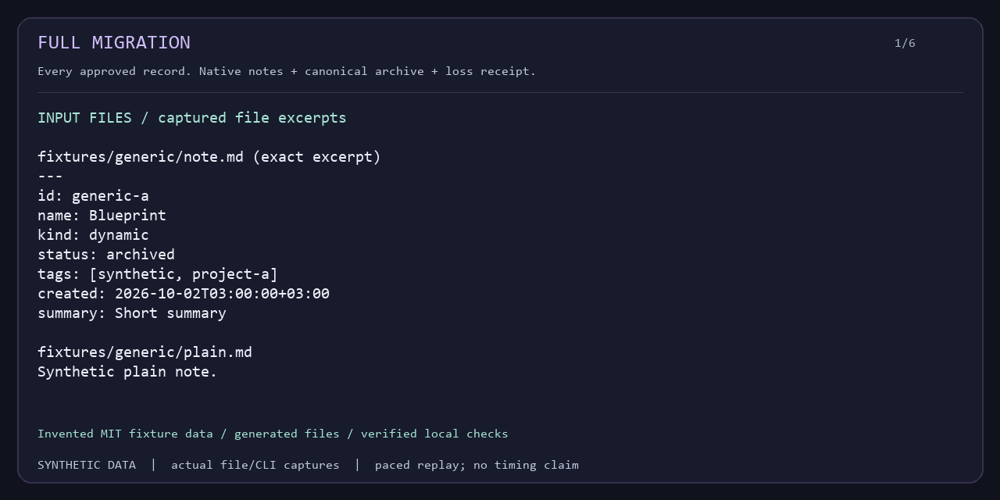
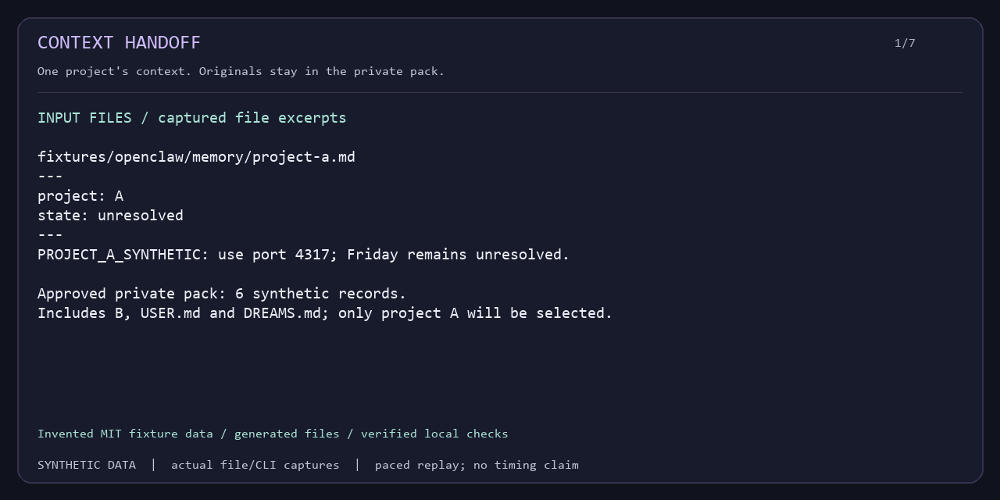

# MemLink

**AI memory portability. Pandoc for AI memories.**

Move your approved memory files, or hand off just one project's context. Offline, with verifiable receipts.


[](https://github.com/velnori/memlink/actions/workflows/test.yml?query=branch%3Amain)
[](https://www.python.org/)
[](docs/guide/releasing.md)
[](LICENSE)

**[Try Full Migration](#quickstart-a-full-migration)** · **[Try Context Handoff](#quickstart-b-context-handoff)** · [Documentation](docs/index.md) · [Replay the demos](docs/guide/demos.md)

## Install this 2.0 checkout

**2.0.0 is an unpublished local candidate.** These examples require this checkout or its locally built wheel. The PyPI package name is `memlink-bridge`; an index install is not the installation path for this candidate.

Use a fresh environment with Python **3.10–3.12**:

```sh
git clone https://github.com/velnori/memlink.git
cd memlink
python -m venv .venv
```

Activate it with `source .venv/bin/activate` on macOS/Linux, or `.\.venv\Scripts\Activate.ps1` in PowerShell. Then, from the checkout:

```sh
python -m pip install .
memlink --version
```

Expected version: `memlink 2.0.0`. The sole runtime dependency is **PyYAML ≥6.0.3**. Installation may access the package index; conversion and verification run offline. If you have a built candidate, use `python -m pip install /path/to/memlink_bridge-2.0.0-py3-none-any.whl`. For fully offline installation, supply both wheels with `--no-index --find-links /path/to/wheelhouse`. See [installation and local release checks](docs/guide/releasing.md).

### Create a trial directory

Keep the environment activated. From the checkout, create a **new sibling directory** and run Quickstart A, then B there. Choose a different name if `memlink-trial` already exists.

macOS / Linux (POSIX shell):

```sh
mkdir ../memlink-trial
cd ../memlink-trial
```

PowerShell:

```powershell
New-Item -ItemType Directory -Path ../memlink-trial -ErrorAction Stop | Out-Null
Set-Location ../memlink-trial
```

## Quickstart A: Full Migration

**Two Markdown memories in. An OpenClaw file workspace out.** `--all` includes the archived source record without per-record classification or review. Run both Quickstarts in the same **new working directory**, outside the checkout. The fixture export creates invented, MIT-licensed data.

<!-- release-example -->
```sh
memlink conformance --export-fixtures fixtures
memlink convert --from generic --to openclaw --source fixtures/generic --target migration --all --format json
memlink validate --from openclaw --source migration --level schema --format json
memlink validate --from generic --source fixtures/generic --level roundtrip --intermediate openclaw --format json
```



*Captured CLI output, with reading pauses. The replay uses the default human-readable output; the commands above return JSON. [Full-size replay](docs/assets/demos/full-migration.gif) · [Static view](docs/assets/demos/full-migration.png) · [Exact output and reproduction](docs/guide/demos.md).*

```text
migration/
├── memory/
│   ├── 2026-10-02.md
│   └── undated.md
└── .memlink/
    ├── archive.json      # complete selected canonical values
    └── receipt.json      # accounting, field outcomes, readback and hashes
```

The two output records pass schema validation and canonical roundtrip through OpenClaw. The conversion reports **`partial` / exit 0**: some fields need the archive rather than becoming native OpenClaw features. Keep the archive beside the notes. Copying only Markdown loses archive-only values.

Default **best effort** completes supported work with an honest receipt. Explicit `--strict` / `--fail-on-loss` blocks unallowed changes before commit and exits **5**. The replay includes a real strict rejection into Mem0 with no target created. [Understand field outcomes](#a-loss-receipt-you-can-read).

Already have a destination workspace? Use `migrate --on-conflict skip|replace|rename`; `skip` is the default. Preview with `--dry-run`, then apply with staging, native readback, conflict checks and backups. [Full Migration tutorial](docs/guide/full-migration.md).

## Quickstart B: Context Handoff

**Give the next agent Project A, while keeping Project B out.** Handoff currently accepts **OpenClaw only**. Use the `fixtures` exported in Quickstart A. Start with all approved memory, then choose just Project A:

<!-- release-example -->
```sh
memlink handoff --from openclaw --input fixtures/openclaw --all --secrets redact --out context-all --format json
memlink verify context-all --format json
memlink pack --from openclaw --input fixtures/openclaw --out private-pack --format json
memlink select private-pack --project A --out selection-a.json --format json
memlink handoff private-pack --selection selection-a.json --secrets redact --out project-a --format json
memlink verify project-a --pack private-pack --format json
```



*The replay deliberately approves synthetic USER/DREAMS inputs to test their exclusion from Project A; the Quickstart uses the default narrower scope. [Full-size replay](docs/assets/demos/context-handoff.gif) · [Static view](docs/assets/demos/context-handoff.png) · [Exact output and reproduction](docs/guide/demos.md).*

| Before: private workspace | After: shareable `project-a/` |
|---|---|
| Project A + Project B; optional profile/dreaming surfaces stay local | `context.md` — selected A reference text |
| Private pack retains original sources and full metadata | `manifest.json` — file set and digests |
| Selection identifies approved records | `report.json` — selection, secret policy, budget and review evidence |

The recording selects **1 A record from 6 private records**. Its output excludes B/profile/configuration/skill marker values from **every public file** and passes `verify --pack`. [Read the actual synthetic context](docs/assets/demos/project-a/context.md). A modified copy fails verification with exit **2**; the original stays valid. Share only the approved `context.md` or verified handoff bundle. Keep the pack, selection and redaction rules private.

For other handoffs, select whole records by project, tag, source or scope. `--all` shares the entire approved memory scope.

**Secret policy matters:** default `--secrets warn` retains detected values. These examples explicitly use `redact`; `fail` stops on detection. Checks are advisory and cannot find every private fact or encoded secret. No-review output records `human_reviewed=false`; optional `--review` requires exact-text TTY confirmation.

Handoff creates **reference context**. Explicitly ask your authorized client to read it; MemLink does not inject hidden Saved Memory. See the [Handoff guide](docs/guide/context-handoff.md), [privacy boundary](docs/guide/context-privacy.md), and [Codex](docs/guide/handoff-codex.md) / [Claude Code](docs/guide/handoff-claude-code.md) file-reading tutorials. Client consumption and model-answer tests are separate from local file verification and remain `NOT_RUN` in this evidence.

## Why MemLink? Why not native import?

Use a native importer when it already accepts your exact export and provides the scope and fidelity you need. MemLink is useful when the work crosses file formats, requires controlled disclosure, or needs an auditable conversion result:

| Developer need | MemLink's approach |
|---|---|
| Move away from a tool without rebuilding notes by hand | Shared Canonical model and reusable Readers/Writers |
| Carry one project's decisions into a new agent session | Whole-record selection, bounded context and a private source pack |
| Know which fields became native and which changed | Real target readback, per-field receipts and canonical archive recovery |
| Inspect the result before using an online client | Local files and offline checks; you decide what to share |

For live service ingestion or native Saved Memory management, use the service's documented facilities. MemLink's verified scope is the **offline file contracts below**.

## Compatibility you can check

**8 Readers · 5 Writers.** Writer support covers new-directory export and safe migration into the declared built-in file targets. “Verified” refers to exact synthetic fixtures and file/transaction layers, not every upstream version or model memory semantics.

| CLI format | Reader | Writer | Actual file scope |
|---|:---:|:---:|---|
| [`generic`](docs/formats/generic.md) | yes | yes | Plain Markdown / YAML frontmatter; generated canonical notes |
| [`openclaw`](docs/formats/openclaw.md) | yes | yes | `MEMORY.md` + recursive memory notes; framed daily output; separate legacy structured variant |
| [`ombre`](docs/formats/ombre.md) | yes | yes | Bucket Markdown under dynamic/permanent/feel |
| [`mem0`](docs/formats/mem0.md) | yes | yes | Offline results/array JSON; user/agent/run scopes |
| [`zep`](docs/formats/zep.md) | yes | yes | Offline facts/results/array/session-summary JSON |
| [`chatgpt`](docs/formats/chatgpt.md) | yes | — | Conversation transcript export; active text branch; **Reader only** |
| [`claude_export`](docs/formats/claude_export.md) | yes | — | Conversation transcript export; supported text blocks; **Reader only** |
| [`stream-summary`](docs/formats/stream-summary.md) | yes | — | `memlink-stream-summary-v1` Markdown; **Reader only** |

ChatGPT/Claude adapters read **transcripts**, not native Saved Memory. Mem0/Zep outputs are **local JSON files**; online import and connectors are not verified. Generic Markdown support does not promise complete Obsidian/Logseq/Bear semantics.

Handoff pack support is **OpenClaw only**: default input is `MEMORY.md` + `memory/**/*.md`. `USER.md` and `DREAMS.md` require explicit flags, including with `--all`. Configuration, credentials, sessions, skills and plugins are excluded from that file scope; sensitive values inside approved notes still need a secret policy.

Inspect the [compatibility manifest](python/memlink/resources/compatibility-manifest-v1.json) with `memlink formats --manifest`, or run `memlink conformance --adapter openclaw --report conformance.json`. [Exact variants, field rules and verification layers](docs/guide/compatibility.md).

## A loss receipt you can read

“Converted” does not mean every field became a native destination feature. `.memlink/receipt.json` records file/record accounting, identity mapping, policies, actual target readback and output hashes. The receipt classifies fields as:

| Outcome | What it means |
|---|---|
| `native-preserved` | Actual native Reader values equal the original, without archive recovery |
| `transformed` | Native mapping changes the value; the original remains in the archive |
| `archive-only` | Native files cannot express it; exact canonical values travel in the archive |
| `dropped` / `unsupported` / `unknown` | Not committed, not mapped, or not measured; never counted as preservation |

**From the real synthetic generic → OpenClaw demo:** selected values from `migration/.memlink/receipt.json` (field labels abbreviated):

```text
status: partial
accounting.output: 2
readback.post_commit: verified
generic-a.metadata: archive-only
```

Two records were written and read back successfully; that metadata remains recoverable in the archive rather than becoming native OpenClaw metadata. [Actual command and captured output](docs/assets/demos/recording.md#full-migration) · [Machine-readable capture and receipt excerpt](docs/assets/demos/recording.json).

Capabilities are preflight hints. **Actual serialization and readback determine the result.** Canonical roundtrip with an intact archive proves recoverable transport, separately from native preservation. A dry run is an estimate with `unknown` field results. [Receipt and exit-code contract](docs/guide/cli.md).

## One bridge, fewer converters: n² → 2n

MemLink is an **AI Memory Interchange Layer**: `Reader → Canonical Memory → Writer`.

For **n formats that each have a Reader and Writer**, direct one-way conversion needs **n(n − 1)** routes: O(n²). A shared model needs **n Readers + n Writers = 2n adapters**: O(n). Ten such formats mean 90 routes versus 20 adapters. Reader-only formats contribute an input path; they do not become destinations.


Two-headed arrows show existing Reader/Writer pairs. One-way arrows show Readers only. The dashed route is the [new-format Plugin extension point](docs/api/plugin.md). A shared schema reduces converter duplication; receipts still expose each destination's field limits. [View the diagram at full size](docs/assets/canonical-bridge.svg).

Canonical is language-neutral and **canonical-v1 remains frozen**. Package 2.0.0 and canonical/receipt/archive/bundle versions are separate dimensions. Default identity is source namespace + scope + native ID. Handoff reuses the interchange layer without becoming a prerequisite for migration. See [Architecture](docs/guide/architecture.md), [Canonical spec](spec/canonical-v1.md), [Plugin API](docs/api/plugin.md), and [1.0.11 → 2.0 upgrade](docs/guide/migration-2.0.md).

## Privacy and practical limits

Core migration, Handoff and verification make no AI API calls, uploads or telemetry requests. They operate on explicit local paths. Installation and a consumer client may use the network independently; third-party plugins are trusted Python code. Migration archives/receipts contain original values and provenance, so treat them as private. [No-network evidence](docs/guide/no-network.md) · [Threat model](docs/guide/privacy.md) · [Private security reporting](SECURITY.md).

The [synthetic benchmark](docs/guide/benchmark.md) completed **1,000 records** for its fixed generator; the 10,000-record cases failed archive/bundle resource limits. This is file-operation evidence, not a throughput, live-ingestion or model-recall promise. Handoff defaults to **1,000 records / 1 MiB UTF-8 text**. Global limits include 16 MiB/file and 256 MiB/scanned root; record count alone does not predict success.

Transactions commit per file, with owned rollback; they do not guarantee global multi-file atomicity or power-loss recovery. Hashes prove consistency, not signed authorship. Redaction and reference rendering do not guarantee complete DLP or a consumer model's resistance to prompt injection. Detailed boundaries and all ceilings are in the [privacy](docs/guide/privacy.md), [CLI](docs/guide/cli.md) and [benchmark](docs/guide/benchmark.md) guides.

## Build the bridge with us

Useful contributions start with a real developer need: an exact file variant, a reproducible field-loss bug, a clearer tutorial, or a Reader/Writer for your format. Bring a small **invented** fixture and a field mapping; keep personal memories and credentials out of issues. [Contributing](CONTRIBUTING.md) · [Request a format](https://github.com/velnori/memlink/issues/new?template=format_request.md) · [Report a bug](https://github.com/velnori/memlink/issues/new?template=bug_report.md).

If memory portability is useful to your work, [star MemLink on GitHub](https://github.com/velnori/memlink) to keep it handy. A small fixture or documentation fix is also a welcome first contribution.

| Find your next step | Documentation |
|---|---|
| Move an existing workspace | [Full Migration](docs/guide/full-migration.md) |
| Control what another agent receives | [Context Handoff](docs/guide/context-handoff.md) · [Handoff privacy](docs/guide/context-privacy.md) |
| Reproduce the screenshots and recordings | [Synthetic demos](docs/guide/demos.md) |
| Check an adapter or build a local candidate | [Compatibility](docs/guide/compatibility.md) · [Release readiness](docs/guide/releasing.md) |
| Extend the interchange layer | [Architecture](docs/guide/architecture.md) · [Plugin API](docs/api/plugin.md) · [Design contract](docs/DESIGN.md) |
| Share a consented observation | [Feedback template](docs/community/feedback.md) · [Real-case template](docs/community/real-case.md) |

<details>
<summary>Development and release evidence</summary>

```sh
python -m pytest tests/ -q
python -m ruff check python/memlink/ tests/ scripts/
python -m ruff format --check python/memlink/ tests/ scripts/
python -m mypy python/memlink/ scripts/
```

Installed conformance needs no test framework. It reports `PASS`, `FAIL` and `NOT_RUN` for fixture goldens, actual readback, archive roundtrip, transactions, rollback, schemas, bundle integrity, network canaries and package integrity. Local evidence does not establish untested OS/Python, remote CI, consumer behavior or adoption. The two marked Quickstarts are executed by the existing release-readiness shell/PowerShell checks. [Reproduction and evidence scope](docs/guide/releasing.md).

</details>

MIT — [LICENSE](LICENSE).
