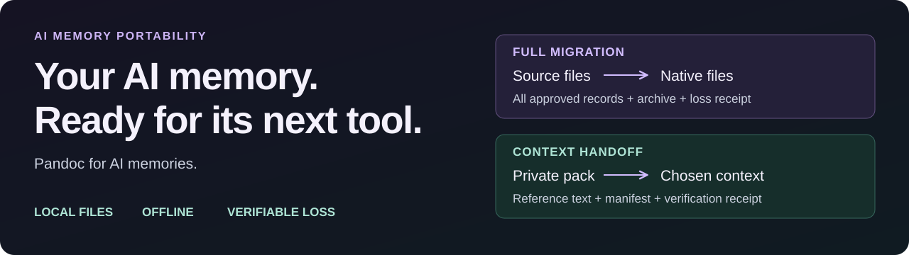

# MemLink

**AI memory portability. Pandoc for AI memories.** Move approved memory files between tools, or hand off just the context another agent needs. Run locally and inspect what the destination preserves.

| Your next step | Start here |
|---|---|
| Move all approved records into a supported file format | [Full Migration Quickstart](guide/quickstart.md#a-full-migration) |
| Share all memory or just one project's reference context | [Context Handoff Quickstart](guide/quickstart.md#b-context-handoff) |
| See the actual commands, outputs and verified synthetic context | [Two reproducible demos](guide/demos.md) |

Check support with the [manifest/conformance](guide/compatibility.md), then inspect [local release evidence](guide/releasing.md), [scale limits](guide/benchmark.md) and [privacy](guide/privacy.md).

MemLink converts and safely migrates approved AI memory files through `Reader → Canonical Memory → Writer`. Full Migration is local, offline and automatic; no AI API, key or per-record review is required. This checkout is the unpublished 2.0.0 implementation; canonical-v1 is unchanged.

| Format | Reader | Writer | Documented file variant |
|---|---|---|---|
| Ombre | yes | yes | [Bucket Markdown](formats/ombre.md) |
| OpenClaw | yes | yes | [Plain workspace notes and framed daily output](formats/openclaw.md) |
| Generic | yes | yes | [Markdown/frontmatter](formats/generic.md) |
| Mem0 | yes | yes | [Offline JSON](formats/mem0.md) |
| Zep | yes | yes | [Offline JSON](formats/zep.md) |
| ChatGPT | yes | no | [Transcript export](formats/chatgpt.md) |
| Claude | yes | no | [Transcript export](formats/claude_export.md) |
| Stream summary | yes | no | [Versioned summary Markdown](formats/stream-summary.md) |

The [canonical bridge](guide/architecture.md#one-bridge-n2-2n) explains **n² → 2n** for formats with both a Reader and Writer. [CLI](guide/cli.md), [2.0 migration](guide/migration-2.0.md), [DESIGN](DESIGN.md) and [Plugin API](api/plugin.md) describe scope, identity, real readback receipts, safe apply and restore limits.

[Context Handoff](guide/context-handoff.md) provides explicit all-record sharing without
human review, or digest-bound selective sharing from a private pack. Both paths are
offline and independently verified. See [privacy](guide/context-privacy.md) and the
[Codex](guide/handoff-codex.md) / [Claude Code](guide/handoff-claude-code.md) consumer guides.
